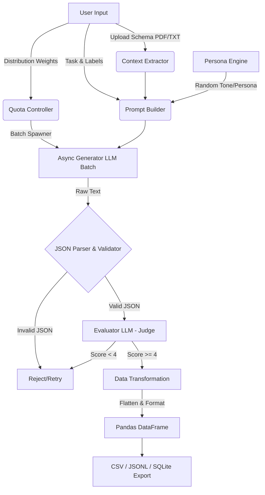

<div align="center">
  <h1>🚀 Structured Synthetic Data Generator</h1>
  <p>An autonomous, multi-agent pipeline for generating high-fidelity, schema-compliant synthetic datasets using LLM-as-a-judge quality gating.</p>
</div>

---

## 📖 Overview
In modern Machine Learning, high-quality data is often the bottleneck. This project is a streamlined, scalable web application built to autonomously generate synthetic structured datasets (JSON/CSV) strictly conforming to user-provided schemas. 

Instead of relying on fragile regex or manual prompt engineering for formatting, the app leverages full-context document parsing to understand complex schemas and features a two-stage **Generation and Evaluation (LLM-as-a-Judge)** pipeline to guarantee both structural validity and semantic accuracy.

## ✨ Key Features
- **🚀 Asynchronous Batch Engine**: Built from the ground up using `asyncio` to execute concurrent API requests in huge batches, dropping generation time from hours to seconds.
- **⚖️ Custom Distribution Quotas**: Dynamic UI sliders allow you to define exact percentage weights (e.g., 90% Safe, 10% Scam), actively throttling and balancing generation to enforce perfect class distributions.
- **🎭 Diversity & Persona Injection**: Automatically injects dynamic personas and randomized tones into every prompt, maximizing dataset entropy and preventing the LLM from generating repetitive patterns.
- **BYOK Multi-Provider Architecture**: Powered by `litellm`, seamlessly switch between **OpenAI, Anthropic, Google Gemini, Groq, Mistral, and Together AI** without changing any code.
- **Strict Schema Adherence & RAG Architecture**: Upload your schema definition via PDF or TXT. The pipeline acts as a robust Retrieval-Augmented Generation (RAG) system, bypassing simplistic chunking and dynamically injecting the full retrieved document as context to strictly enforce valid structured JSON outputs.
- **🎓 Advanced LLM-as-a-Judge**: Rejects simple pass/fail mechanics. The evaluator strictly grades generation on a 1-5 scale, enforces a passing threshold (>=4), and records detailed reasoning traces for why data succeeded or failed.
- **💰 Live Cost & Token Analytics**: Integrates real-time LiteLLM cost tracking, summarizing total fraction-of-a-cent API spend per session on the dashboard.
- **💾 MLOps Ready Exports**: Output instantly as `CSV`, `JSONL`, or utilize the native **SQLite Database Export** to seamlessly append data directly to your local SQL tables for training pipelines.

## 🛠️ Tech Stack
- **Frontend / UI**: [Streamlit](https://streamlit.io/) for rapid, interactive dashboarding.
- **LLM Orchestration**: [LiteLLM](https://litellm.vercel.app/) for unified, provider-agnostic API calling.
- **Data Engineering**: [Pandas](https://pandas.pydata.org/) for tabular transformation and I/O.
- **Context Parsing**: [Langchain Community](https://python.langchain.com/docs/integrations/document_loaders/) (`PyPDFLoader`, `TextLoader`) for robust document extraction.

---

## 🧠 Pipeline Architecture & Data Flow



1. **Initialization & Context Loading**: The user defines the target generation task and a list of output labels (e.g., `Spam, Ham`). A schema document is uploaded and parsed entirely into raw text to maintain structural rules.
2. **Generation Phase**: The configured Generation Provider (e.g., `groq/llama3-8b-8192`) is prompted with the full schema context and a randomized target label. It is aggressively constrained to output valid JSON.
3. **Structural Validation**: A programmatic parsing layer attempts to deserialize the output. Hallucinated markdown blocks or invalid structures are stripped and dropped.
4. **Semantic Evaluation Phase**: The successfully parsed JSON is forwarded to an Evaluation Provider (e.g., `gemini-1.5-flash`). This "Judge" agent cross-references the generated JSON against the original task constraints. It guarantees that the data not only matches the schema but makes logical sense for the assigned label.
5. **Aggregation**: Surviving high-quality records are merged with their label metadata and appended to the dataset, ready for export.

## 🚀 Getting Started

### Prerequisites
- Python 3.9+
- Pip

### Installation
1. Clone this repository.
2. Install the required dependencies:
```bash
pip install -r requirements.txt
```

### Running the Application
Launch the Streamlit server locally:
```bash
streamlit run app.py
```

### Usage
1. Open the local server URL provided by Streamlit.
2. Enter your API Keys in the sidebar for the providers you wish to use (OpenAI, Anthropic, Gemini, Groq, etc.).
3. Define your **Generation Provider** and **Evaluation Provider**.
4. Define your **Task Description** and comma-separated **Categories/Labels**.
5. Upload your target JSON schema as a `.pdf` or `.txt`.
6. Click **Generate Data** and watch the pipeline build your dataset!

## 🤝 Contributing
Contributions, issues, and feature requests are welcome! Feel free to check the issues page if you want to contribute.
